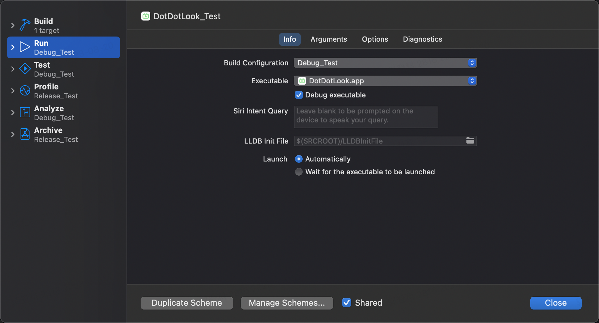
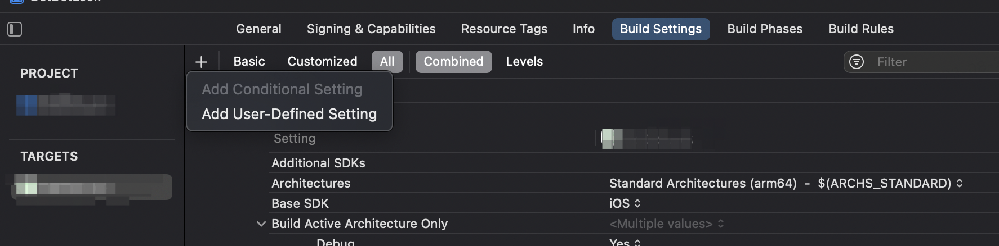
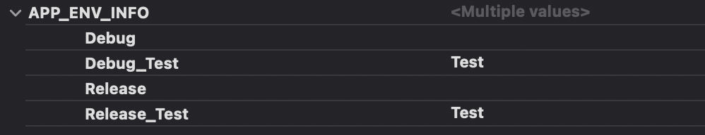

# 第三节：Xcode自定义环境配置

##### 1、配置Configurations

打开**PROJECT**工程，在**Info**下会看到**Configurations**选项。如下图：


默认情况下，项目会生成两种配置Debug和Release，开发时运行代码使用 Debug 配置，打包一般使用 Release配置，基于这两种配置我们可以做到的是基于当前环境(debug还是release)来设置不同的环境。

如：Spring环境根据debug和release可以设置对应的Debug_Test和Release_Test。

##### 2、新增Scheme

首先我们项目默认只有一个Scheme，相应的Run和Archive操作也默认对应了Debug和Release环境。

我们新增两种环境后，首先想到的就是新增一个Scheme配置，然后将新增的Scheme的Run和Archive操作对应到我们新增的两种环境即可。如下图所示，我们新增了一个Scheme，然后修改了其Run/Archive操作到对应的Debug_Test和Release_Test环境。这样我们就可以通过两个Scheme来进行四种环境的操作了。



新增Scheme和编辑Scheme的时候记得勾选**Shared**。

##### 3、定义User-defined setting

选中当前Target，在Build Settings栏点击+号，选择 Add-user-defined setting。



新增了一个名为**APP_ENV_INFO**的字段，然后在不同的环境下配置了相应的环境标识。



在info.plist中新增APP_ENV_INFO_KEY字段，将值设置成$(**APP_ENV_INFO**)。


##### 4、获取环境

上述准备工作完成后，就可以通过设置的环境标识获取不同的环境。

```swift
static var isTest: Bool {
    guard let value = Bundle.main.object(forInfoDictionaryKey: "APP_ENV_INFO_KEY") as? String else {
        return false
    }

    return value == "Test"
}
```

##### 5、与CocoaPods结合使用

可以在podfile中配置库的安装环境。

```ruby
pod 'DoraemonKit/Core', '~> 3.0.4', :configurations => ['Release_Test']
pod 'FMDB', '~> 2.7.5', :configurations => ['Release_Test']
pod 'GCDWebServer', :configurations => ['Release_Test']
```

